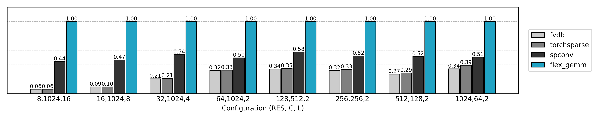
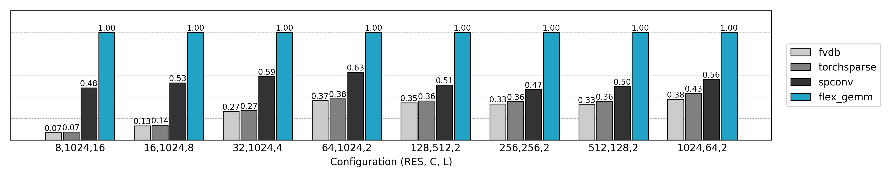
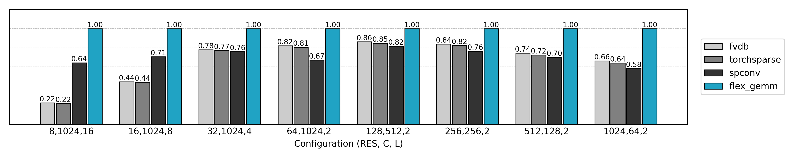

# FlexGEMM

**FlexGEMM** is a **Triton-powered GEMM backend** for **3D sparse convolutions**.
It implements **Explicit**, **Implicit**, **Masked Implicit** algorithm variants, with optional **Split-K** parallelism for sparse GEMM, delivering **state-of-the-art performance** for Submanifold Convolution and voxel-based neural networks.

## Why FlexGEMM?

* **Triton-first**: Built on [Triton](https://github.com/openai/triton) for high performance and cross-platform GPU kernels.
* **Sparse-ready**: Optimized for 3D sparse tensors with highly irregular sparsity.
* **Fast**: Consistently outperforms existing sparse convolution libraries.

## Installation

```bash
git clone https://github.com/JeffreyXiang/FlexGEMM.git
cd FlexGEMM
pip install .
```

Requires:

* PyTorch ≥ 2.4.0
* Triton ≥ 3.2.0

## Example

```python
import torch
import flex_gemm
from flex_gemm.ops.spconv import sparse_submanifold_conv3d
from tests.spconv_fwd import sphere_coords

# Sparse voxel shell
feats, coords, shape = sphere_coords(256, 256, dtype=torch.float16, device='cuda')

# Weight and bias
Ci, Co = 256, 256
Ks = 3
weight = torch.randn(Co, Ks, Ks, Ks, Ci, dtype=torch.float16, device='cuda', requires_grad=True)
bias = torch.randn(Co, dtype=torch.float16, device='cuda', requires_grad=True)

# Set algorithm: Masked + Split-K
flex_gemm.ops.spconv.set_algorithm(
    flex_gemm.ops.spconv.Algorithm.MASKED_IMPLICIT_GEMM_SPLITK
)

out_feats, neignbor_cache = sparse_submanifold_conv3d(
    feats, coords, shape,
    weight, bias,
)

out_feats.sum().backward()
```

## Performance 

**Environment:**

* NVIDIA A100 (80 SMs)
* PyTorch 2.4.1
* CUDA 12.0
* Triton 3.2.0

**Training speed comparison under FP16 precision:**



**Training speed comparison under TF32 precision:**



**Training speed comparison under FP32 precision:**




### Summary

* **FlexGEMM consistently outperforms `spconv`, `torchsparse`, and `fvdb`** in terms of training speed for 3D sparse convolutions.
* **Significant speedups** are observed across both low- and high-resolution sparse tensors, achieving up to **\~2× acceleration** compared to previous state-of-the-art methods under efficient data format like FP16 and TF32.
* **Memory-efficient**: Achieves higher throughput without increasing GPU memory usage.
* **Robust across channel and resolution scales**: Performs well for both wide (C=1024) and narrow (C=64) feature maps, as well as small (RES=8) and large (RES=1024) voxel grids.
* **Ideal for large-scale 3D networks**: Particularly suitable for high-resolution voxelized point clouds, submanifold convolutions, and octree-based architectures.


## License

MIT.

